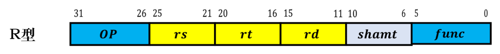
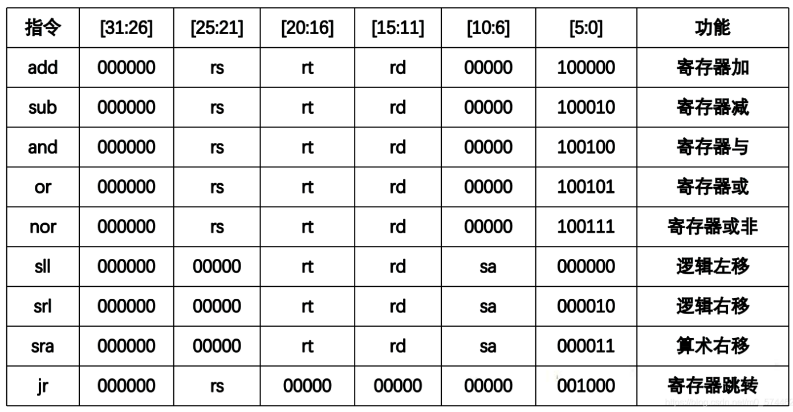
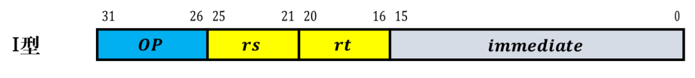
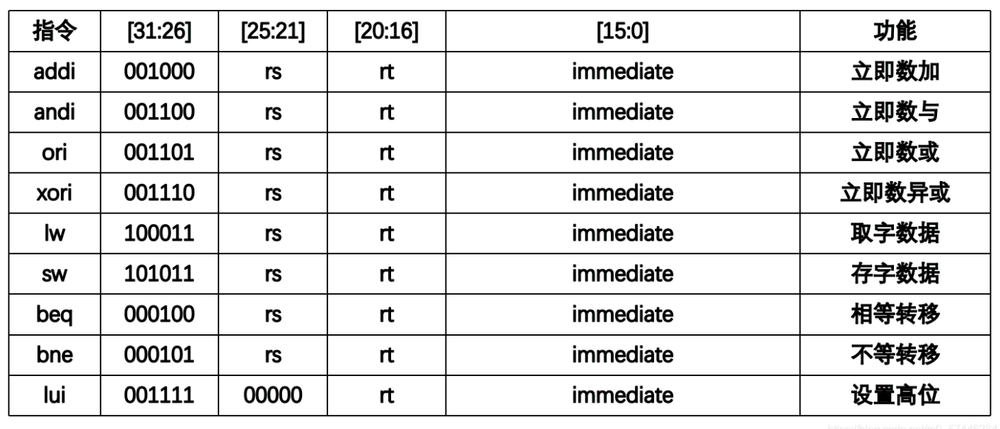
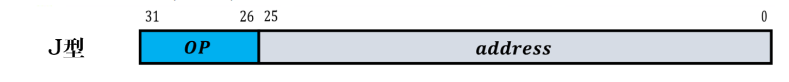
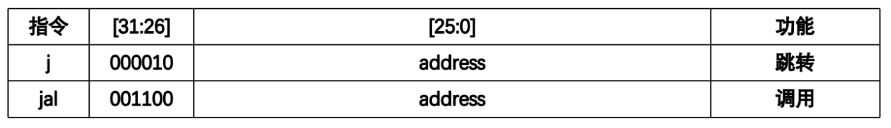

# MIPS 三种指令类型及格式
MIPS（Microprocessor withoutInterlockedPipelineStages），是一种采取精简指令集（RISC）的指令集架构（ISA），由美国MIPS计算机系统公司开发，现为美普思科技。MIPS广泛被使用在许多电子产品、网络设备、个人娱乐设备与商业设备上。最早的MIPS架构是32位，最新的版本已经变成64位。商业市场主要竞争对手为ARM与RISC-V。2021年3月，MIPS宣布MIPS架构的开发已经结束，因为该公司正在向RISC-V过渡。

[MIPS](https://so.csdn.net/so/search?q=MIPS&spm=1001.2101.3001.7020)的指令可以分为3种操作类型

- R型：寄存器型指令
- I型：立即数型指令
- J型：跳转型指令

下文中出现的所有指令的含义可自行bing或google。

## R型指令

- 操作码`OP`：6 bit，对于所有R型指令，该域的值均为0，需要结合功能码`func`来指定指令操作
- 源寄存器`rs`：5 bit，通常用于指定第一个源操作数所在的寄存器编号
- 目标寄存器`rt`：5 bit，通常用于指定第二个源操作数所在的寄存器编号
- 目的寄存器`rd`：5 bit，用于指定目的操作数（保存运算结果）的寄存器编号
- 移位量`shamt`：5 bit，用于指定移位指令进行移位操作的位数，对于非移位指令，该域设为0
- 功能码`func`：6 bit，用于指定具体的操作类型，与操作码`OP`一起构成了R型指令的12位操作码

常用的R型指令的指令表如下：

## I型指令

- 操作码`OP`：6 bit，用于指定指令的具体操作
- 源寄存器`rs`：5 bit，通常用于指定第一个源操作数所在的寄存器编号
- 目标寄存器`rt`：5 bit，通常用于指定目的操作数（保存运算结果）的寄存器编号
- 立即数`immediate`：16 bit，立即数

常用的I型指令的指令表如下：

## J型指令

- 操作码`OP`：6 bit，用于指定指令的具体操作
- 地址`address`：J型指令包含一个26位的跳转目标地址。这个地址用于指定跳转的目标位置。

常用的J型指令的指令表如下：

