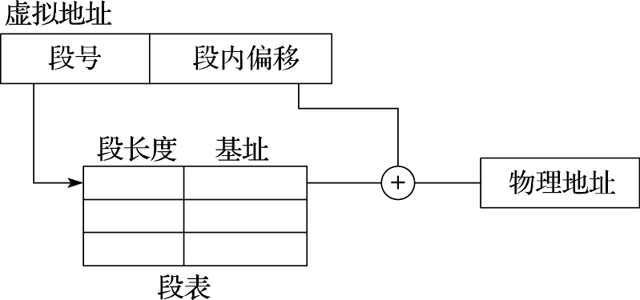
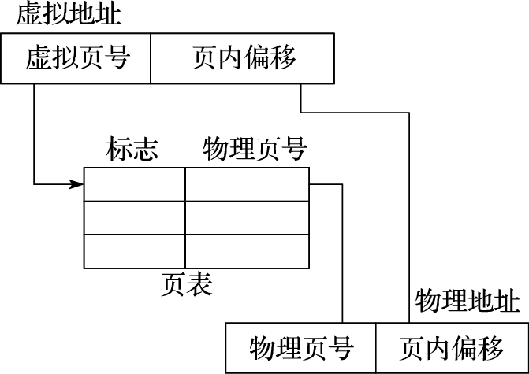
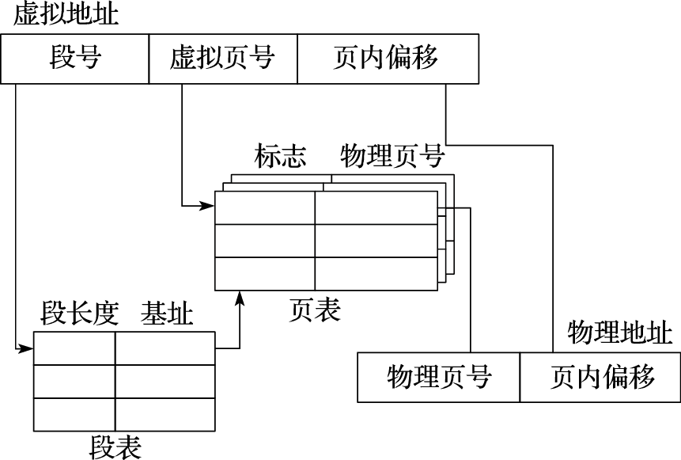

# 计算机中存储管理的演变

**存储器**是冯·诺依曼结构计算机的核心部件，存储管理的演变是指令系统演变的重要组成部分。

> 冯·诺依曼结构最核心的思想是什么？
>
> 冯·诺依曼结构就是**数据和程序都存在存储器中**，CPU从内存中取指令和数据进行运算，并且把结果也放在内存中。概括起来就是**存储程序**和**指令驱动执行**。

存储管理的演变经历了连续实地址、段式、页式虚拟存储等阶段。

- **连续实地址**的管理方式是最早期也是最朴素的方式，各程序所需的内存空间必须连续存放并保证不与其他程序产生冲突。这种方式不但会带来大量的内存碎片，而且难以管理多个程序的空间分配。
- **段式存储管理**将内存分为多个段和节，地址组织为相对于段地址的偏移。段式存储主要应用于早期处理器中，Burroughs公司的B5000是最早使用段式存储的计算机之一。Intel从8086处理器开始使用段式存储管理，在80286之后兼容段页式，但在最新的X86-64位架构中放弃了对段式管理的支持。
- **页式虚拟存储管理**将各进程的虚拟内存空间划分成若干长度相同的页，将虚拟地址和物理地址的对应关系组织为页表，并通过硬件来实现快速的地址转换。现代通用处理器的存储管理单元都基于页式虚拟管理，并通过TLB进行地址转换加速。页式虚拟存储可使各进程运行在各自独立的虚拟地址空间中，并提供内存映射、公平的物理内存分配和共享虚拟内存等功能，是计算机系统发展过程中具有里程碑意义的一项技术。

## 段式存储管理

段式存储管理的地址转换过程如图所示。虚拟地址分为段号和段内偏移两部分，地址转换时根据段号检索段表，得到对应段的起始物理地址（由段长度和基址可得），再加上段内偏移，得到最终的物理地址。需要注意的是，段表中存有每个段的长度，若段内偏移超过该段长度，将被视为不合法地址。

段式存储管理具有如下特点：

- 在段式存储管理中，每个段（如代码段、数据段、堆栈段等）可以被分配到物理内存中的任何位置。这意味着**段的起始地址是独立的**，可以根据需要进行配置。这种灵活性允许程序的不同部分被加载到物理内存中的不同位置。
- 尽管每个段可以独立地放置在物理内存的任何位置，但**段内的所有地址必须是连续的**。这意味着一旦一个段被加载到内存中，它必须作为一个整体被处理，段内的地址是从段的起始地址开始的连续地址。这种连续性要求确保了程序在访问段内数据时的一致性和可预测性。
- 当程序的段占用的空间较大时，可能会出现**内存碎片问题**。内存碎片是指由于内存分配和释放的不连续性，导致内存中出现许多小的、不连续的空闲区域，这些区域太小而无法被有效利用。在段式存储中，如果一个大型段被释放，它可能会在内存中留下一个大的空闲区域。如果后续的内存请求无法完全填满这个区域，那么剩余的部分就会成为碎片。随着时间的推移，这些碎片会累积，导致内存的有效利用率降低，甚至可能出现虽然总的空闲内存量足够，但却无法找到足够大的连续空间来满足新的内存请求的情况。

## 页式存储管理

页式存储管理的地址转换过程如图所示。虚拟地址分为虚拟页号和页内偏移两部分，地址转换时根据虚拟页号检索页表，得到对应的物理页号，与页内偏移组合得到最终的物理地址。

相比段式存储管理，页式存储管理具有如下特点：

| 页式存储管理                                                 | 段式存储管理                                                 |
| ------------------------------------------------------------ | ------------------------------------------------------------ |
| 页的大小固定                                                 | 段的大小可变                                                 |
| 使用页号和偏移量进行地址转换                                 | 使用段号和偏移量进行地址转换                                 |
| 页式存储管理可以有效地减少外部碎片（因为页的大小固定），但可能会产生内部碎片（因为最后一页可能未被完全使用） | 段式存储管理可能会产生更多的外部碎片，因为段的大小不固定，释放后的内存空间可能不连续。内部碎片较少，因为段可以根据实际需要分配大小。 |

## 段页式存储管理

在实际应用中，许多现代操作系统（如Windows和Linux）使用段页式存储管理，结合了页式和段式存储管理的优点，以提高内存管理的效率和灵活性。

段页式管理结合了段式和页式的特点，其地址转换过程如图所示，虚拟地址分为段号、虚拟页号和页内偏移三部分，地址转换时首先根据段号查询段表得到对应段的页表起始地址，再根据虚拟页号查询页表得到物理页号，与页内偏移组合得到最终的物理地址。段页式同样需要检查段地址的合法性。

段页式存储管理结合了段式和页式存储管理的优点，提供了以下优势：

- 段页式存储管理允许将内存划分为段和页的组合，这样可以方便地管理不同类型的程序和数据，同时可以细致地进行内存分配和利用。
- 通过设置段和页的访问权限，可以对内存进行精细的访问控制，保护数据的安全性。
- 段页式存储管理支持多个程序共享同一段或同一页面，减少内存重复存储，提高内存利用效率。
- 通过页表和页面地址转换，实现虚拟地址到物理地址的映射，为虚拟内存提供支持，提高系统的内存容量和隔离性。
- ......

